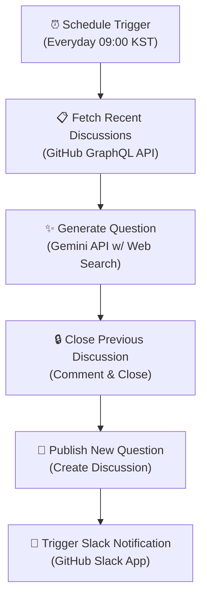

## System Architecture

이 저장소는 n8n 기반의 자동화 파이프라인을 통해 매일 아침 CS 질문을 생성하고 마감하는 구조로 운영됩니다.

### Pipeline Overview

1. **Schedule Trigger**
   * EC2 인스턴스에서 호스팅되는 n8n 워크플로우가 매일 09:00 KST에 크론 작업으로 실행됩니다.
2. **Fetch Recent Discussions**
   * GitHub GraphQL API를 사용하여 최근 생성된 Discussion 30개의 제목 및 본문을 조회합니다.
   * 조회된 데이터는 중복 질문 생성을 방지하기 위한 컨텍스트 데이터로 사용됩니다.
3. **Generate Question**
   * Gemini API(웹 검색 기능 포함)를 통해 최신 기술 트렌드를 반영한 범용 CS 질문 1건을 생성합니다.
   * 특정 프로그래밍 언어, 프레임워크, 클라우드 vendor에 종속되지 않는 핵심 개념 질문을 선별하며, 2단계에서 수집한 이력을 바탕으로 중복을 검증합니다.
4. **Close Previous Discussion**
   * 전일 생성된 Discussion에 마감 안내 댓글을 작성한 후 `Close` 상태로 전환합니다.
   * *Note: 쓰기 권한을 완전히 제한하는 `Lock` 처리는 하지 않으므로 마감 이후에도 댓글 참여가 가능합니다.*
5. **Publish New Question**
   * 생성된 CS 질문을 저장소의 GitHub Discussion 카테고리에 신규 게시글로 등록합니다.
6. **Trigger Slack Notification**
   * GitHub Slack Integration을 통해 지정된 Slack 채널(`매일매일-CS한잔`)로 신규 Discussion 등록 이벤트 알림이 전송됩니다.

---

## Repository Structure

| 경로 / 기능 | 설명 |
| :--- | :--- |
| **Discussions** | 질문 및 답변 데이터가 축적되는 메인 데이터 저장소 |
| `n8n/daily-question-workflow.json` | n8n 워크플로우 내보내기(Export) JSON 파일 (복구 및 마이그레이션용) |

> **Note**: 실제 파이프라인 프로세스는 외부 인프라(AWS EC2 n8n Instance)에서 구동되며, 본 저장소는 결과물 데이터(질문/답변)를 관리하는 저장소 역할만을 수행합니다.

제안 사항이나 파이프라인 구조 변경에 대한 모듈식 개선 의견은 `Issues` 탭을 통해 전달해 주시기 바랍니다.